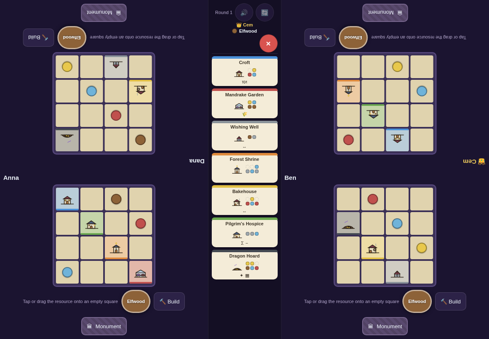
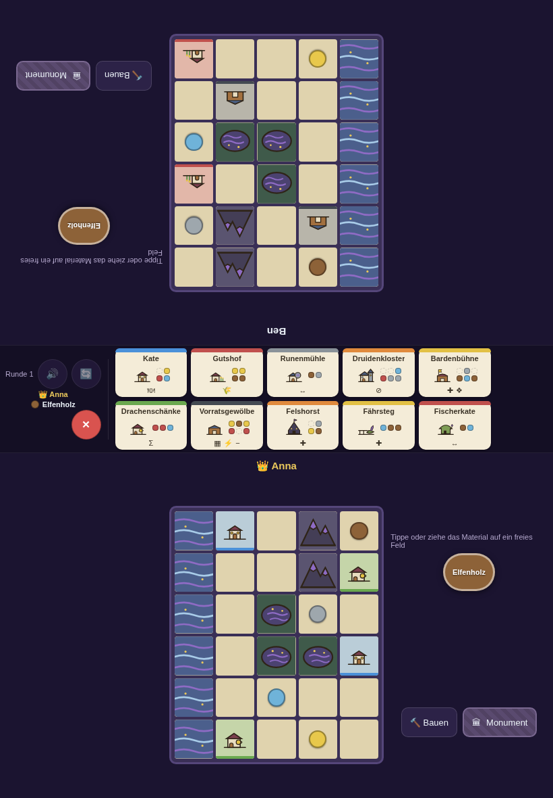
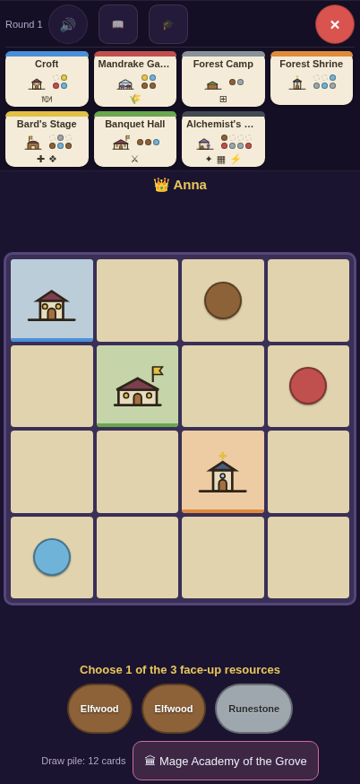
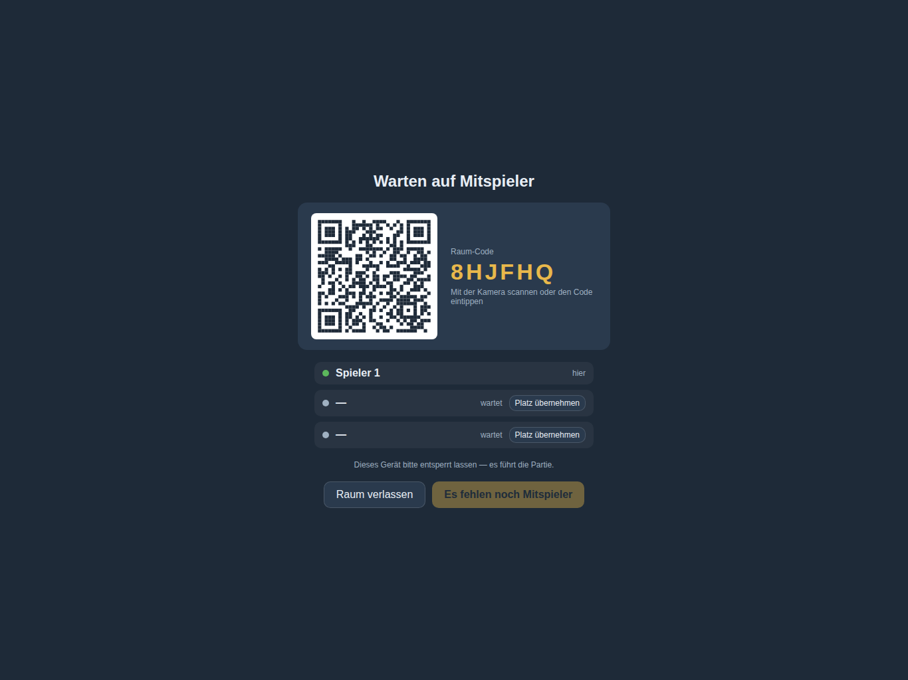
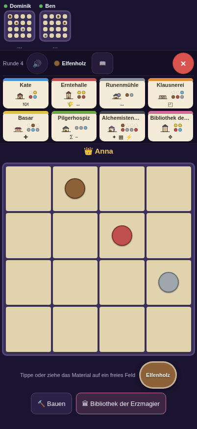
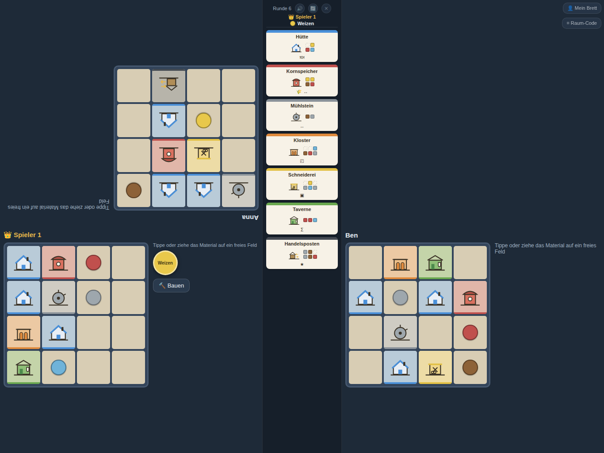

# Baumeister

A digital adaptation of the board game *Tiny Towns* (base game) — a purely client-side
web app (PWA) for **tablets and phones**. The classic mode puts **2–4 players around
one tablet in landscape**: everyone plays simultaneously at the four corners of the
device, with the game's 7 building cards in the middle — or each player joins with
their own device. It plays in a **dragon realm** by default — crofts, elfwood and
moongrain, all of it our own — with a Mars colony and the classic forest town a
tap away in the 🎨 picker. Beside it stands **Countryside** (🏞), our own variant on a taller
5×6 board with a river, mountains and a lake you cannot build on, and three extra
waterfront cards that score next to them. Solo, daily challenge, learning mode and
several expansions are all in the box.

**▶ Play: [d0m1n1kr.github.io/baumeister](https://d0m1n1kr.github.io/baumeister/)**

## In the game

**One tablet, four towns.** Everyone plays at the same time; each corner is
rotated toward its player, and the round's building cards sit in the middle.
The Master Builder (👑) has named elfwood — everyone places it on their own board.



**Countryside: a taller board with a landscape in it.** 5 wide and 6 high — the
shape of a phone held upright. The river, the ridge and the lake are unbuildable,
and the three waterfront cards (here Ferry Pier, Fisher's Croft, Dwarven Digs)
only score next to the matching terrain. Every player gets the same map, so the towns
stay comparable. Next to it a solo game on a phone: your own board large, the
deck's three face-up resources below it.

| Countryside for two, on a tablet held upright | Solo on a phone |
| --- | --- |
|  |  |

**Everyone on their own device — no server.** The host opens a room; the others
join by scanning the QR code with the normal camera app (or typing the
6-character code). Seats can be mixed: some players on the host tablet, others
on their own phone.

| Host opens a room | Guest on their phone |
| --- | --- |
|  |  |

On a phone you get your own board big, with the opponents shown as compact
mini boards above — and your monument stays genuinely secret, because nobody
else's device ever receives it.

**The host still sees the whole table.** Here Dominik plays on the host tablet
while Anna and Ben are on their phones — the state is identical on every device
(the host runs the engine and broadcasts it).



## Features

- **Fully automated rules:** pattern validation (rotation + mirroring), all building
  effects (Factory, Bank, Trading Post, Warehouse, …), every monument effect, and the
  complete final scoring including optimal feeding assignment.
- **Complete base game:** 25 building cards + 15 monuments as extensible
  JSON/SVG assets (`src/data/`, schema in [`src/data/schema.md`](src/data/schema.md)).
- **Expansions (selectable in setup):**
  - *Fortune* — the full coin mechanic (earn on 2+ builds, chest with 4 slots,
    pay a coin for a different resource, 1 VP per coin) plus 12 buildings and
    10 monuments. All 22 cards verified against the official card texts
    (sources in `schema.md`).
  - *Tiny Trees* — seed tokens: building over a seed grants a free resource; as the
    last empty square, the seed becomes a tree (2 points).
- **Themes (per device):** the **dragon realm** (the default), a **Mars colony**,
  or the classic forest town — same rules, different world. The dragon realm
  leads because its names, texts and artwork are original throughout: out of the
  box the app shows none of the original game's wording. The classic world is
  one tap away for anyone who wants the names they know. Every card (base game,
  monuments, Fortune, station) gets its own name, rule text, and artwork, and the
  vocabulary changes with it: on Mars you supply habitats in a colony with
  regolith and ice, coins become power cells; in the dragon realm you provision
  crofts in a hamlet with elfwood, dragonscale, runestone, moongrain, and
  faeglass, coins become **mana**, and Tiny Trees seeds become faeseeds growing
  into a World Tree. The railway changes shape too: a **transit capsule** gliding
  through a tube with airlocks, or a **dragon** flying along the board edges with
  three slings, vanishing into cloud banks and roaring as it lands on an eyrie.
  Since the game state is theme-agnostic, players in one multi-device game can
  each use their own theme. Switch via the 🎨 picker.
- **8 languages:** German, English, French, Spanish, Italian, Dutch, Portuguese,
  Polish — auto-selected from the browser language, overridable via the 🌐 switcher
  (setup and join screens). All rule error messages are translated too; card texts
  fall back to the English originals outside German.
- **Cavern rule (selectable in setup, off by default):** set aside up to 2 resources
  named by others per game — at the end they count neither points nor penalties.
- **Town Hall mode (official variant, selectable in setup):** no Master Builder —
  a resource deck (15 cards, 5 discarded face-down) drives two rounds; every 3rd
  round everyone chooses freely. Factory/Warehouse/coin swap apply to drawn cards,
  the Bank blocks your free choice, Fort Ironweed sits out free rounds.
- **Railway mode (our own digital-native variant, selectable in setup):** tracks
  run permanently along the top and bottom edges of the play area, with tunnel
  portals at the ends. A train with 3 wagons (behind the locomotive) is always
  visible with its load; at the end of every round it drives to the next town —
  with steam sounds while moving and a horn when it pulls into a station. With a
  built **train station** (an 8th card laid out for everyone, max. 1 per town,
  must sit on the track — the bottom row of your town) you may load the received
  resource into an empty wagon instead of placing it — or swap it for a wagon's
  contents. The train stops at every town either way; without a station you just
  can't load or unload. The wagons are public: what you drop off, an opponent may
  grab along the way.
- **Multi-touch:** several players can drag & drop resources onto their boards at
  the same time; each corner is rotated toward its player.
- **Monument secrecy:** draw 2 / secretly pick 1, revealing only after confirmation
  ("Everyone else look away!").
- **Card zoom:** tapping enlarges any card, rotated toward the tapping player;
  mini cards show build patterns, feature icons, and schematic artwork.
  In the single-board view (own device), **detail mode** (📖) keeps all cards with
  their descriptions permanently visible — no more tapping required.
- **Solo mode (official variant):** 15 resource cards as a deck, 3 face up, one is
  chosen and rotates face-down to the bottom. With the official rank table
  (up to "Master Architect"), a per-device highscore list, and a **daily challenge**
  (fixed date seed — the same cards worldwide, scores comparable). Today and the
  last 14 days can be picked with ‹ › next to the date; the future stays locked,
  or tomorrow's setup would be known in advance. **The daily always plays pure:**
  base game with monuments, no expansions and no extra modes, and local
  checkboxes cannot change it — the rule sits in `buildGameConfig`, not just in
  the setup screen. That is not cosmetic: expansions deal different cards, and
  even switching monuments off used to shift the RNG (the monument deck then
  draws nothing) and with it the resource deck, so the same date was not the
  same game. Countryside stays allowed — it is the board, and it travels in the
  shared link.
- **Share your result:** the score screen offers two buttons for solo games —
  one shares the text (rank, score, buildings and, for a daily challenge, a
  `#daily=<date>` link that opens exactly that day's setup on the other device),
  the other shares a 1080×1080 score card rendered on a canvas in the theme you
  are playing. They are separate on purpose: when a file is shared, iOS passes
  only the file on to the target and drops the text, so one call cannot reliably
  deliver both. The image button only appears where the browser can share files
  (iOS 15+, Chromium on Android); everything that matters is also written into
  the image, so that path is complete by itself. Where sharing is unavailable the
  text goes to the clipboard. The board layout is deliberately left out of both
  text and image: with an identical setup it would be the solution.
  A shared link always opens in the browser on iOS — Safari never hands `https`
  links to a home-screen app, and Universal Links would need a native app plus a
  file at the domain root. The manifest carries `id`, `scope`, `start_url` and
  `launch_handler` so Chromium can route such links into the installed app; on
  iOS the day picker above is the way to a shared challenge.
- **Countryside mode (🏞, 5×6, any player count):** a taller board — 5 wide, 6 high, which
  is the shape of a phone held upright — with seeded terrain: a river crossing
  edge to edge, a mountain ridge and a lake, all unbuildable. Terrain takes
  9–13 squares, so 17–21 of the 30 stay buildable: a little more room than the
  classic 16, without dragging a game out.
  The layout is generated from the seed with hard constraints (no enclosed
  buildable region under 5 squares, a free 2×4 window so the biggest monument
  stays buildable, at most 2 corners covered) and is frozen by golden-seed
  tests, so the daily challenge shows the same map worldwide. Three extra
  waterfront cards join the usual seven (Fisherman's Hut, Watermill, Ore Mine,
  Ferry Landing, Alpine Hut, Boathouse — 3 drawn of 6). Each asks a different
  question rather than all asking "is there terrain next to me": the Boathouse
  escalates with how many of them stand **on the water** (1/3/6/10 like the
  Tavern), the Watermill counts adjacent red buildings but only if it touches
  the river, the Ferry Landing counts river squares in its whole row and column,
  and the Alpine Hut only pays while it is alone in its row and column. Their
  ceilings are held to the base game's band (2 cells → 1–2 points, 3 cells →
  2–4) by a test that measures every position across 30 generated landscapes. **Every player gets the same landscape** — a different one
  per player would be a different game, and the towns could not be compared.
  Countryside dailies use their own seed stem and share links carry
  `&mode=land`; highscores and rank thresholds are kept separate
  from the classic list (solo only). Everything else combines freely: the
  expansions, the Town Hall variant, the cavern rule and the railway all work
  on the taller board — it is a different board, not a different game (the
  daily challenge is the one exception: there it plays pure, see above). With the
  railway on, the terrain generator additionally guarantees a spot for the
  train station on the track (the bottom row); without that guarantee about one
  layout in five left the station unbuildable. Terrain artwork adapts to the
  theme (canyon/crater field/ice lake on Mars, mistflow/dragonspire/spelllake
  in the dragon realm).
- **Learning mode (🎓, solo):** a guided game for newcomers. Instruction bubbles
  walk through every phase — monument draft, deck pick, placing, marking a
  pattern, choosing the spot, ending the round, finishing the town — and each one
  also says what changes **with several players** (a Master Builder instead of
  the deck, simultaneous play, swap cards only on another player's naming). The
  suggested square is highlighted with its reason ("2 of 3 for the Farm"); the
  advice comes from a pure analyser (`src/engine/advice.ts`) that reuses the
  pattern matcher, so it never proposes an illegal move — and stays silent when
  it has nothing useful to say. Bubbles are dismissed one at a time and stay
  away for the rest of that game — every new learning game explains again; the
  final screen sums up the multiplayer differences.
- **Two ways to play:**
  - *On one device* (default, unchanged): taking turns around the same tablet,
    **fully offline**.
  - *With everyone's own devices*: the host opens a room, players join via QR code
    (camera app or the built-in scanner — important for the installed PWA) or a
    6-character code — **no server**, directly device to device (WebRTC).
    Seats can be mixed: some players on the host device, others on their own phone.
    Monuments are truly secret for the first time.
- **Sound effects (can be muted):** warm marimba, wood, and bell tones —
  fully synthesized via Web Audio (no asset files, no licensing questions,
  offline). Resource call, placement (pitch per resource), building, monument bell,
  coin, tree, error tone, "your turn", and the final fanfare; 🔊 toggle in the card
  strip, the choice is remembered per device.
- **Persistence:** autosave to `localStorage` after every action, "Continue" after reload.
  The start screen also remembers what you picked last time — player count,
  one-device vs. own-devices, the solo variant, Countryside, monuments and the
  chosen expansions — saved on start, when the choice is real. Seating is not
  remembered (it follows the player count) and neither is the challenge date
  (that one is always today). A shared challenge link is the exception in both
  directions: it overrides the remembered choices for that visit and is not
  written back, so one shared link cannot silently turn your default into
  "1 player, daily challenge".
- **Buy the original:** the start screen and the score screen carry one line —
  "Enjoying the game? Buy the original here:" — searching for *Tiny Towns* in
  the Amazon store of the interface language (`src/data/shop.ts`, one row per
  country). Deliberately **not** an affiliate link: no associate tag, no
  commission. That keeps this a fan project with no commercial purpose — which
  is also why it needs no advertising disclosure and no imprint. It is a plain
  `<a>`: no script, no tracker, nothing loaded, so the app stays offline-capable
  and the link only leaves the app when tapped. A test asserts that the URL
  carries no parameter but the search term.
- **PWA:** fully offline-capable (all assets are precached on first visit; game
  logic and game state live entirely in the client). The start screen offers to
  install the app: on Chromium the system dialog via `beforeinstallprompt`, on
  iOS/iPadOS — where WebKit provides no such interface — a two-step guide to
  "Add to Home Screen". The hint stays away once dismissed and never shows in an
  already installed app. The app checks for new versions on start, on returning
  to the app, and every 15 minutes, offering an update via banner; the running
  game survives the update.

## Development

```bash
npm install
npm run dev        # dev server
npm test           # engine, network, and store tests (Vitest)
npx vitest run --coverage   # same with coverage report
npm run check      # svelte-check
npm run build      # production build (dist/)
node scripts/smoke.mjs        # E2E: single-device mode (Chromium)
node scripts/smoke-multi.mjs  # E2E: multi-device mode in two tabs
node scripts/smoke-learn.mjs  # E2E: learning mode (bubbles, phone + tablet)
node scripts/shots.mjs        # regenerates the screenshots in docs/screenshots/
```

The screenshots above are generated, not hand-made: `scripts/shots.mjs` drives a
real Chromium through the app — in English, like this README — and writes all
six files. Every shot is a recipe
(viewport, player count, mode, game state), so after a design change the images
are one command away from being current again — and they show the app as it
really renders, not as it once looked.

The multi-device test runs with `?transport=channel`: the same session and host code,
but over `BroadcastChannel` between two tabs instead of real P2P — testable without
any network. This switch is also handy for developing on a desktop.

## Architecture

```
src/engine/   Pure-TS game logic (no DOM): reducer, patterns, scoring, effects,
              move advice for the learning mode — Vitest-tested
src/data/     Card assets: JSON per card + SVG artwork, loaded automatically
src/i18n/     Translations (8 languages), language detection, error-message mapping
src/theme/    Themes (Mars, dragon realm): card/resource/UI overrides per device
src/ui/       Svelte 5 components (game table, corners, cards, dialogs, lobby)
src/store/    Engine↔UI binding, localStorage persistence, drag state
src/net/      Multi-device mode: protocol, swappable transport, seats, session
```

### Multi-device mode

The host runs the game engine and is the rules authority; guests only send actions
and render the received state (~3 KB, transferred in full — no deltas).
The redirection sits in exactly one place (`netBridge` in `src/store/gameStore.svelte.ts`):
without an active session, exactly the previous single-device path runs.

The transport sits behind a narrow interface (`src/net/transport.ts`) — there is a
P2P variant (Trystero, lazy-loaded only when needed), a BroadcastChannel variant for
tests, and an in-memory variant for unit tests. Swapping the signaling service does
not touch the game logic. Signaling runs over a **hand-picked list of 8 large Nostr
relays** (`trysteroTransport.ts`) instead of Trystero's random draw — the list is the
meeting point of all devices; change it only together with `PROTOCOL_VERSION`.
While connecting, the app shows how many relays are reachable (also in the host lobby
and the room-code dialog). After a longer stay in the background, the app rebuilds the
room from scratch — Nostr relays forget their subscriptions when the socket drops, and
Trystero 0.25 does not renew them after a reconnect (the device would still send but
no longer hear anything).

**iOS quirk:** when the app goes to the background or the display locks, iOS kills
every connection — no technique prevents that. The app therefore keeps the screen
awake during the game (Wake Lock) and re-syncs the full state on every return to the
foreground; disconnected seats stay reserved. If the tab is fully reloaded (iOS likes
doing that too), a guest rejoins automatically (the session lives in `localStorage`;
while connecting it re-calls every 3 s with a 30 s deadline, and even after a failure
the session is kept for the next attempt). The host restores both the game **and** the
room via "Continue" — guests then reconnect on their own. Via the room-code button in
the game, the host can also **hand seats to (new) devices via QR** at any time — even
mid-game, including the game state.

**New cards** only need a JSON file (+ optional SVG) in `src/data/buildings/` or
`src/data/monuments/` — as long as they use existing scoring/effect building blocks,
no code is required. Details: [`src/data/schema.md`](src/data/schema.md).

## Deployment

The workflow `.github/workflows/deploy.yml` builds on every push to `main` and
publishes to **GitHub Pages**. One-time setup:
repo settings → *Pages* → *Source: GitHub Actions*.

## Note

**Baumeister** is a non-commercial fan project. It is not affiliated with,
authorised or endorsed by AEG. *Tiny Towns* is a game by Peter McPherson,
published by AEG, and is named here only to say what this app plays — the app
itself is called Baumeister. All graphics are original, schematic recreations;
no original assets are used, and nothing here is sold or monetised.
